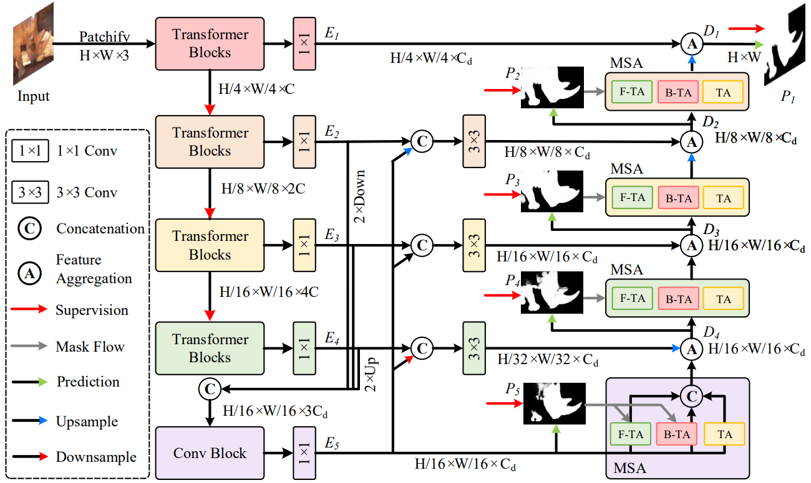
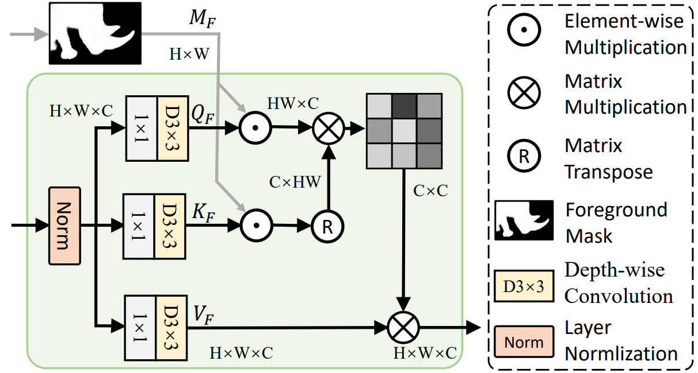
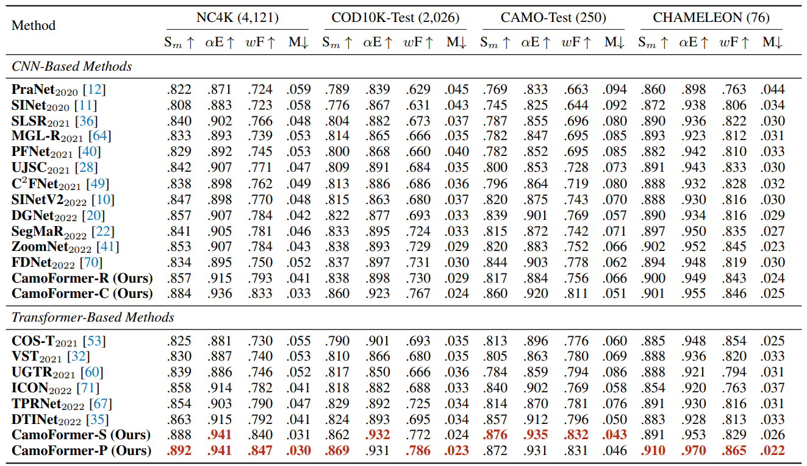

# <p align=center>`Jittor Implementation of CamoFormer`</p>

> **Jittor** is a high-performance deep learning framework based on JIT compiling and meta-operators. The whole framework and meta-operators are compiled just-in-time. A powerful op compiler and tuner are integrated into Jittor. It allowed us to generate high-performance code with specialized for your model. Jittor also contains a wealth of high-performance model libraries, including: image recognition, detection, segmentation, generation, differentiable rendering, geometric learning, reinforcement learning, etc. The front-end language is Python. Module Design and Dynamic Graph Execution is used in the front-end, which is the most popular design for deeplearning framework interface. The back-end is implemented by high performance language, such as CUDA, C++.

This repository contains the source code, prediction results for 'CamoFormer: Masked Separable Attention for Camouflaged Object Detection'. The technical report could be found at [arXiv](https://arxiv.org/abs/2212.06570). 
The whole benchmark results can be found at [One Drive](https://mailnankaieducn-my.sharepoint.com/:f:/g/personal/bowenyin_mail_nankai_edu_cn/EmB36EZb_fdMvWGgKx2EalgBuQnj8AFifyR-ip7Jtkfwqg?e=nu6DJz), [Baidu Netdisk](https://pan.baidu.com/s/1k5CxYzcgizzJ4sRdAxBNlA?pwd=srtf), or [Google Drive](https://drive.google.com/drive/folders/1gsCeYtS9cwsMpTHQzkx81n4jsRK4LYdf?usp=sharing).

Contributors: [2112529](https://github.com/2112529), [yinbow](https://github.com/yinbow)


<p align="center">
     <br />
    <em> 
    Figure 1: Overall architecture of our CamoFormer model. First, a pretrained Transformer-based backbone is utilized to extract multi-scale features of the input image. Then, the features from the last three stages are aggregated to generate the coarse prediction. Next, the
progressive refinement decoder equipped with masked separable attention (MSA) is applied to gradually polish the prediction results. All
the predictions generated by our CamoFormer are supervised by the ground truth (GT).
    </em>
</p>


## 2. Get Start

**0. Install**

Create environment by `python3.7 -m pip install jittor` on Linux. 
As for MacOS or Windows users, using Docker `docker run --name jittor -v $PATH_TO_PROJECT:/path -it jittor/jittor /bin/bash` 
is easier and necessary. 
A simple way to debug and run the script is running a new command in the container through `docker exec -it jittor /bin/bash` and start the experiments. (More details refer to this [installation tutorial](https://github.com/Jittor/jittor#install))

<!-- ```
conda create --name CamoFormer python=3.8.5
conda activate CamoFormer
conda install pytorch==1.12.1 torchvision==0.13.1 cudatoolkit=11.3 -c pytorch
pip install opencv-python
conda install tensorboard
conda install tensorboardX
pip install timm
pip install matplotlib
pip install scipy
pip install einops

Please also install [apex](https://github.com/NVIDIA/apex).
git clone https://github.com/NVIDIA/apex
cd apex
pip install -v --no-cache-dir --global-option="--cpp_ext" --global-option="--cuda_ext" ./
``` -->


**1. Download Datasets and Checkpoints.**

- **Datasets:** 

By default, you can put datasets into the folder 'dataset'.

[Baidu Netdisk](https://pan.baidu.com/s/1Tcvt0IJYdKSYAb_BD5QrTg?pwd=2gf4),
[One Drive](https://mailnankaieducn-my.sharepoint.com/:f:/g/personal/bowenyin_mail_nankai_edu_cn/EuSpxg1R9l1OmSkOqlUpMCcBvOE-JgtaeJVZfwwKOEjJhQ?e=sCWZE9)

- **Checkpoints:** 

By default, you can put datasets into the folder 'checkpoint'.

CamoFormer: [Baidu Netdisk](https://pan.baidu.com/s/1QyE_HkxCp9vWlhnJAx20dQ?pwd=f4bp), [One Drive](https://mailnankaieducn-my.sharepoint.com/:f:/g/personal/bowenyin_mail_nankai_edu_cn/Eg2fWTz1pjFBiJfAdj1XqGQBbQ2pOjpNq0AbIjseadTgSA?e=BFvBkU)
Backbone: [Baidu Netdisk](https://pan.baidu.com/s/1E10fb4_Gr08_6LV6AdyhSg?pwd=pgdk),  [One Drive](https://mailnankaieducn-my.sharepoint.com/:f:/g/personal/bowenyin_mail_nankai_edu_cn/Et3EzPUD2GJOn1YafL1NDDYBXwWtdsLd3EZCVua-mVSdhw?e=7XoXoR)

**2. Run the model.**
```
bash main.sh
```


## 3. Proposed CamoFormer

<!-- ### 3.1. The F-TA in MSA:


<p align="center">
     <br />
    <em> 
    Figure 2: Diagrammatic details of the proposed F-TA in our MSA. Our B-TA shares a similar structure except for the mask.
    </em>
</p> -->


### COD Benchmark Results:

The prediction of our CamoFprmer can be found in [One Drive](https://mailnankaieducn-my.sharepoint.com/:f:/g/personal/bowenyin_mail_nankai_edu_cn/EmB36EZb_fdMvWGgKx2EalgBuQnj8AFifyR-ip7Jtkfwqg?e=nu6DJz), [Baidu Netdisk](https://pan.baidu.com/s/1k5CxYzcgizzJ4sRdAxBNlA?pwd=srtf), or [Google Drive](https://drive.google.com/drive/folders/1gsCeYtS9cwsMpTHQzkx81n4jsRK4LYdf?usp=sharing). Here are quantitative performance comparison.

<p align="center">
     <br />
    <em> 
    Figure 3: Comparison of our CamoFormer with the recent SOTA methods. ‘-R’: ResNet, ‘-C’: ConvNext, ‘-S’: Swin Transformer, ‘-P’: PVTv2. As can be seen, our CamoFormer-P performs much better than previous methods with either CNN- or
Transformer-based models. ‘↑’: the higher the better, ‘↓’: the lower the better.
    </em>

</p>


## Acknowlegement
Thanks [mczhuge](https://github.com/mczhuge) providing a friendly [codebase](https://github.com/mczhuge/ICON) for binary segmentation tasks and [Daniel Ji](https://github.com/GewelsJI) providing a good [Jittor codebase](https://github.com/GewelsJI/SINet-V2/tree/main/jittor_lib) for COD.  And our code is built based on them. 
Thanks to [2112529](https://github.com/2112529) for his significant contributions and great effort in implementing the Jittor version of the code.


## Reference
You may want to cite:
```
@article{yin2024camoformer,
  title={Camoformer: Masked separable attention for camouflaged object detection},
  author={Yin, Bowen and Zhang, Xuying and Fan, Deng-Ping and Jiao, Shaohui and Cheng, Ming-Ming and Van Gool, Luc and Hou, Qibin},
  journal={IEEE Transactions on Pattern Analysis and Machine Intelligence},
  year={2024},
  publisher={IEEE}
}
```

### License

Code in this repo is for non-commercial use only.


